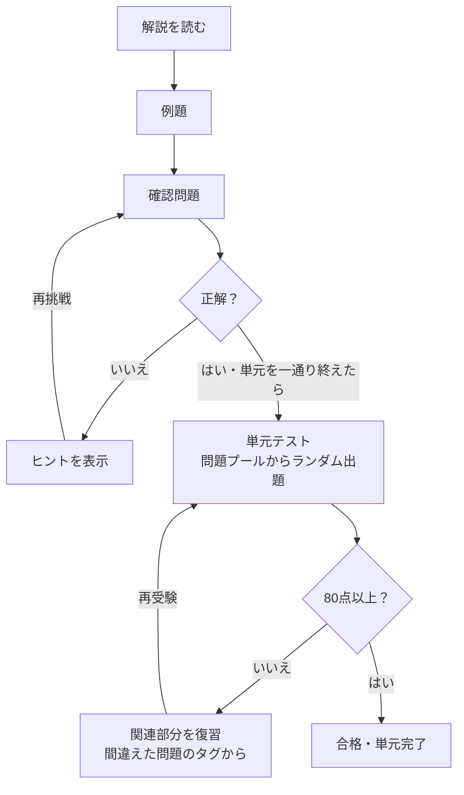

# 数学学習アプリ 要件定義書

## 概要

中学1年〜高校数学C（数学IIIを除く）を、単元ごとに解説→例題→確認問題→単元テストの流れで学べるWebアプリ。中高生が初見で理解できる内容を基本とし、大人の学び直しにも使える構成にする。

| 項目 | 内容 |
| --- | --- |
| ターゲット | 中高生（初見で理解できる難易度）、大人の学び直し |
| 対象範囲 | 中1〜中3、数学I・A・II・B・C（数学IIIは除外） |
| 準拠 | 現行の学習指導要領（中学2021年度〜、高校2022年度〜） |
| 形態 | Webアプリ（スマホ中心、PC・タブレット対応） |

## 学習フロー



確認問題で間違えたらヒントを見て再挑戦する。単元テストは80点以上で合格、80点未満なら間違えた問題に関連する部分を復習してから再受験する。

## 機能要件

### 単元マップと前提関係

- 中1〜数学Cの単元を一覧で表示する（単元一覧は「単元マップ」の章を参照）
- 各単元に前提単元を表示し、つまずいたときに前の単元へ戻れる導線を用意する
- 前提単元はロックしない。未合格の前提単元がある場合は「先にこちらがおすすめ」と案内する

### 解答入力（専用キーパッド）

- 解答はアプリ独自のキーパッドで入力する
- 基本キー：数字、x・a・b、²、( )、不等号、等号
- 単元ごとに必要なキーだけを表示する切り替え式にする（高校範囲で追加するキーの例：√、分数、π、sin・cos・tan、log、i）
- 指数キーは、押したあとに入力した数字を右上に入れる（2⁴ など²以外の累乗も入力できる）

### 採点

- 答え方は問題文で指定する（例：「降べきの順に答えよ」）
- 正解はキーパッドが出力する表記で問題データに保存し、入力と照合する（例：分数は -3/4、素因数分解は 2^4*3）

### ヒントと解き方

- 確認問題で間違えたら、段階的にヒントを表示する
- 正解・不正解にかかわらず、解き方を表示できる

### 単元テスト

- 単元の学習が一通り終わったら受験できる
- 10問×10点。80点（8問正解）以上で合格。制限時間はなし
- 不合格でも再受験できる
- 出題は問題プールからランダムに選び、各小単元から最低1問は出す（プールは各小単元5問程度）
- 各問題に、対応する小単元のタグを付ける
- 不合格時は、間違えた問題のタグをもとに関連する小単元の復習へ誘導する

### 進捗と復習

- 単元ごとの完了状況と正答率を表示する
- 間違えた問題の復習リストと、弱点単元を表示する

### 数式・グラフ・図形の表示

- 数式を正しい表記で表示する
- 関数の単元ではグラフを、図形問題では図形を表示する

### データの書き出し・読み込み

- 学習進捗をファイルに書き出し、読み込んで復元できる（バックアップと端末間の移行用）

## 非機能要件

| 項目 | 要件 |
| --- | --- |
| 対応端末 | スマホ中心。PC・タブレットでもレイアウトが崩れないこと |
| 公開先 | GitHub Pages（mainブランチからそのまま配信、ビルドなし） |
| 技術スタック | HTML/CSS/JavaScript（フレームワーク・ビルドツールなし） |
| データ保存 | localStorageに保存する（サーバー・アカウントなし） |
| バックアップ | 進捗の書き出し・読み込みで、データ消失と端末間の移行に備える |
| コンテンツ管理 | アプリのコードと問題バンク（問題データ）を分けて管理する |
| 問題の著作権 | すべてオリジナル問題とし、教科書・問題集からは流用しない |

localStorageは端末・ブラウザごとに別保存のため、スマホとPCで進捗は共有されない。またiPhoneのSafariでは、Safariを7日間使う間に一度もサイトを開かないと保存データが削除される（ホーム画面に追加したWebアプリは対象外）。書き出し・読み込み機能はこの対策を兼ねる。（[出典](https://ionic.io/blog/is-apple-trying-to-kill-pwas)）

## 単元マップ（案）

数学IIIを除く43単元。前提単元は主なものだけを挙げている。

| 区分 | 単元 | 前提単元 |
| --- | --- | --- |
| 中1 | 正負の数 | なし |
| 中1 | 文字の式 | 正負の数 |
| 中1 | 一次方程式 | 文字の式 |
| 中1 | 比例と反比例 | 文字の式 |
| 中1 | 平面図形 | なし |
| 中1 | 空間図形 | 平面図形 |
| 中1 | データの活用（ヒストグラム・相対度数） | なし |
| 中2 | 式の計算 | 文字の式 |
| 中2 | 連立方程式 | 一次方程式、式の計算 |
| 中2 | 一次関数 | 比例と反比例、一次方程式 |
| 中2 | 平行と合同 | 平面図形 |
| 中2 | 三角形と四角形 | 平行と合同 |
| 中2 | 確率 | データの活用 |
| 中2 | データの比較（箱ひげ図） | データの活用 |
| 中3 | 展開と因数分解 | 式の計算 |
| 中3 | 平方根 | 展開と因数分解 |
| 中3 | 二次方程式 | 展開と因数分解、平方根 |
| 中3 | 関数y=ax² | 一次関数 |
| 中3 | 相似な図形 | 三角形と四角形 |
| 中3 | 円 | 三角形と四角形、相似な図形 |
| 中3 | 三平方の定理 | 平方根、相似な図形 |
| 中3 | 標本調査 | データの比較 |
| 数I | 数と式 | 展開と因数分解、平方根 |
| 数I | 集合と命題 | 数と式 |
| 数I | 二次関数 | 関数y=ax²、二次方程式 |
| 数I | 図形と計量（三角比） | 三平方の定理 |
| 数I | データの分析 | データの比較 |
| 数A | 場合の数と確率 | 確率、集合と命題 |
| 数A | 図形の性質 | 円、相似な図形 |
| 数A | 整数の性質 | 数と式 |
| 数II | 式と証明 | 数と式 |
| 数II | 複素数と方程式 | 二次関数、式と証明 |
| 数II | 図形と方程式 | 一次関数、二次関数、三平方の定理 |
| 数II | 三角関数 | 図形と計量、図形と方程式 |
| 数II | 指数関数・対数関数 | 数と式 |
| 数II | 微分 | 二次関数、図形と方程式 |
| 数II | 積分 | 微分 |
| 数B | 数列 | 数と式 |
| 数B | 統計的な推測 | データの分析、場合の数と確率、積分 |
| 数C | 平面ベクトル | 図形と計量、図形と方程式 |
| 数C | 空間ベクトル | 平面ベクトル、空間図形 |
| 数C | 平面上の曲線 | 図形と方程式、三角関数 |
| 数C | 複素数平面 | 複素数と方程式、三角関数、平面ベクトル |

高校の「数学と人間の活動」（数A）からは整数の性質のみを採用し、「数学と社会生活」（数B）と「数学的な表現の工夫」（数C）は探究型で問題にしにくいため外している。

## 最初に作る単元：中1 正負の数

単元マップの起点で必要なキーも少ないため、データ形式を小さく試す最初の単元にする。

| 小単元ID | 小単元 |
| --- | --- |
| s1 | 正の数・負の数と数直線（符号、反対の性質をもつ量） |
| s2 | 絶対値と数の大小 |
| s3 | 加法と減法 |
| s4 | 乗法と除法（累乗を含む） |
| s5 | 四則の混じった計算 |
| s6 | 素因数分解 |
| s7 | 正の数・負の数の利用（基準との差から平均を求めるなど） |

キー構成：数字0〜9、小数点、＋、−、×、( )、指数、分数、<、>、削除。答えは基本的に1つの数のため、÷と＝は使わない。

## 2つ目の単元：中1 文字の式

正負の数の次に学ぶ単元。文字を使って数量や関係を表し、1次式の計算までを扱う。

| 小単元ID | 小単元 |
| --- | --- |
| s1 | 文字を使った式（数量を文字で表す） |
| s2 | 文字式の表し方（×・÷を省く、累乗、分数の形） |
| s3 | 式の値（文字に数を代入する） |
| s4 | 項と係数、1次式の加法・減法 |
| s5 | 1次式と数の乗法・除法 |
| s6 | 関係を表す式（等式・不等式） |

キー構成：数字0〜9、小数点、＋、−、( )、指数、分数、x、y、a、b、＝、<、>、削除。文字式では×と÷を省いて書くため、×・÷のキーは使わない。

採点は、キーパッドの出力が正解の表記と一致したときに正解とする。答え方（項の順番など）は問題文で指定し、同じ意味の書き方が複数ある場合は answers に複数入れる。

## 3つ目の単元：中1 一次方程式

| 小単元ID | 小単元 |
| --- | --- |
| s1 | 方程式とその解 |
| s2 | 等式の性質を使った解き方 |
| s3 | 移項を使った解き方 |
| s4 | かっこ・小数・分数を含む方程式 |
| s5 | 比例式 |
| s6 | 一次方程式の利用 |

キー構成：数字0〜9、小数点、＋、−、( )、分数、x、＝、削除。方程式の解は「x=3」「x=-3/2」の形で答える。文章題の答えは数だけを答える（単位はつけない）。

## 4つ目の単元：中1 比例と反比例

| 小単元ID | 小単元 |
| --- | --- |
| s1 | 比例の式 |
| s2 | 座標 |
| s3 | 比例のグラフ |
| s4 | 反比例の式 |
| s5 | 反比例のグラフ |
| s6 | 比例と反比例の利用 |

キー構成：数字0〜9、小数点、−、分数、x、y、＝、削除。式は「y=3x」「y=12/x」の形で答える。座標を問うときは、x 座標か y 座標の一方を数で答える。

グラフは、図の種類「座標平面」（figure の type が `coordPlane`）としてアプリ側で SVG を描く。目盛り・点・比例のグラフ（y=ax）・反比例のグラフ（y=a/x）を表示できる。

## 問題バンクのデータ形式

問題データはJSONでアプリのコードと分け、単元マップのファイルと単元ごとのファイルで構成する。

| ファイル | 内容 |
| --- | --- |
| data/units.json | 単元マップ（単元ID、学年、単元名、前提単元、キー構成） |
| data/units/{単元ID}.json | 小単元ごとの解説・例題・確認問題と、単元テスト用の問題プール |

| フィールド | 内容 |
| --- | --- |
| id | 問題ID |
| section | 小単元ID（単元テストのタグを兼ねる） |
| role | 例題・確認問題・テストの区別（example / check / test） |
| question | 問題文 |
| answers | 正解の配列（キーパッドの出力表記。基本は1つ） |
| hints | 段階的に出すヒントの配列 |
| solution | 解き方 |
| figure | 図の種類と値（数直線・グラフ・図形）。描画はアプリ側でSVGを生成する |

```json
{
  "id": "j1-signed-s3-c02",
  "section": "s3",
  "role": "check",
  "question": "(−5)+(+8) を計算しなさい。",
  "answers": ["3"],
  "hints": ["符号が異なる2数のたし算です。", "絶対値の差に、絶対値が大きいほうの符号をつけます。"],
  "solution": "(−5)+(+8) = +(8−5) = 3",
  "figure": null
}
```

解説は「テキスト・数式・図」のブロックを並べた配列で持ち、Markdownの変換なしで描画する。JSONはfetchで読み込むため、開発中はローカルサーバー（VS CodeのLive Serverなど）で動かす（GitHub Pagesではそのまま動く）。

## 今後の検討事項

- [x] 最初に作る単元 → 中1 正負の数
- [x] 正負の数の小単元分割とキー構成 → 決定（「最初に作る単元」を参照）
- [x] 問題バンクのデータ形式 → 決定（「問題バンクのデータ形式」を参照）
- [x] 単元テストの問題数・配点と制限時間 → 10問×10点、制限時間なし
- [x] 前提単元のロック → ロックせず「先にこちらがおすすめ」と案内する
- [x] 探究型の単元 → 除外する
- [x] 2つ目の単元（文字の式）の小単元分割とキー構成 → 決定（「2つ目の単元：中1 文字の式」を参照）
- [x] 3つ目の単元（一次方程式）の小単元分割とキー構成 → 決定（「3つ目の単元：中1 一次方程式」を参照）
- [x] 4つ目の単元（比例と反比例）の小単元分割とキー構成 → 決定（「4つ目の単元：中1 比例と反比例」を参照）
- [ ] 残りの単元の小単元分割とキー構成を決める
